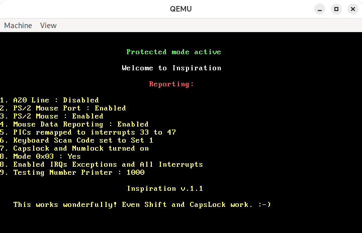

Blaze O.S.
==========

A fast, hobby operating system for x86 PCs.



This `README` file and the `extras` folder are not part of the original source
code. They have been added for the convenience of the reader.

**NOTE**: This version of the O.S. is kept for historical reasons only.

Version 0.1.1 was last modified on 07 December 2013 at 08:12:02 am.

The kernel has been renamed multiple times. Once it was 'Inspiration' as in
the comments. For a full list of features see `extras/CHANGES.md`.

Features in v0.1.1
------------------

- Switch characters output on Shift and CapsLock usage on keyboard.
- Toggle CapsLock, NumLock, ScrollLock LEDs on keyboard when these keys are
  pressed.
- Hitting Escape reboots the system.
- Added a number output function in the screen driver.

Building
--------

These tools are required for building the O.S.:

- **Compiler**: GCC (`gcc`, `ar`, `ld` and `objcopy`) with i386 binary target.
  - GCC on a GNU/Linux distro.
  - MinGW on Windows.
  - DJGPP on DOS (or 32bit Windows).

- **Assembler**: NASM.

Read `extras/BUILD.md` for more information.

See the `vX.Y.Z-buildable` tags for a buildable set of source files.
The `master` branch features the original sources that shouldn't compile.

Running on a Virtual Machine
----------------------------

This O.S. has been tested on Bochs, QEMU and VirtualBox.

Both QEMU and Bochs support floppy images of any size. Just configure
the O.S. image as a regular floppy disk. A light skim through the documentation
should tell you how.

VirtualBox seems to need exact sized floppy images. The O.S. image should be
padded at the end with zeroes to a size of exactly 1440KB. This can achieved
on Linux like so:

```shell
dd if=/dev/zero of=padfile bs=1 count=PADSIZE
cat boot.img padfile > floppy.img
```

Where `PADSIZE` is 1474560 - 'Size of boot.img'. (1474560 is the number
of bytes in 1440KB.)

This should do it on Windows:

```batchfile
fsutil file createnew padfile PADSIZE
copy /B boot.img+padfile floppy.img
```

Note that `fsutil`, being a command that does more damage than just create
blank files, requires Administrator Privileges. You might need to install
Windows Subsystem for Linux on Windows 10 and above to run `fsutil`. But you
can just run the Linux commands then.

Running on a Real Machine
-------------------------

**Warning**: Writing a raw binary file to a storage device makes it's previous
content unreadable by conventional methods. Make sure to back up the contents
before proceeding.

To run this version on a real machine, you need a floppy drive and disk. Write
the O.S. image to the first sectors of the floppy. Any bootable device, like
a USB flash drive or even a hard disk should work too. 

Next, go into the BIOS boot menu and boot from the storage medium with
the O.S. image.

I'm not going to explain how you write raw sectors to a storage medium here.
If you truly wanna try it, you should be able to find that out yourself.
